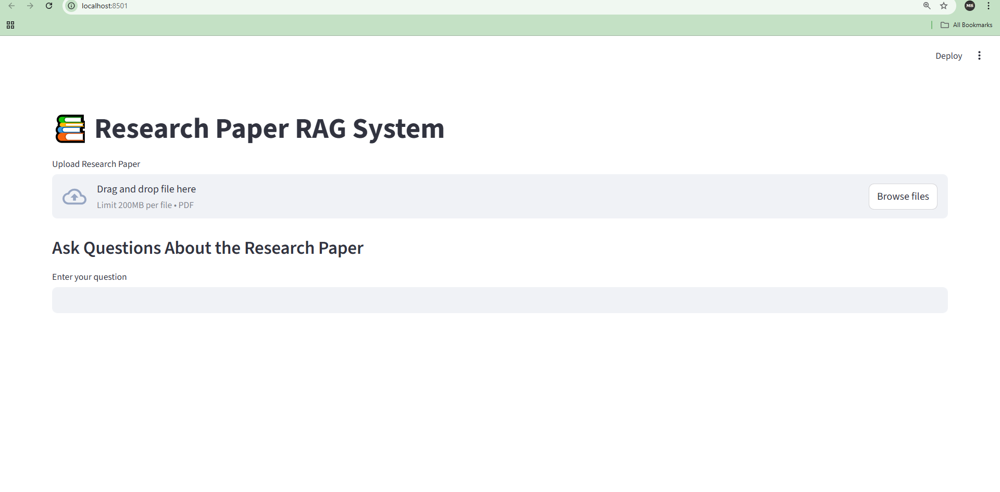

# 📚 Research Paper RAG System (Hybrid + RAGAS Evaluated)

An end-to-end **Retrieval-Augmented Generation (RAG)** system that allows users to upload research papers (PDFs) and ask intelligent questions. The system retrieves context using **Hybrid Search (Vector + BM25)**, reranks results using a **Cross-Encoder**, and generates grounded answers using an LLM with **citations (page + paragraph level)**.

---
<p align="center">
  
</p>

## 🚀 Features

- 📄 Upload and process research paper PDFs
- 🧠 Hybrid retrieval system:
  - Semantic search using SentenceTransformers + ChromaDB
  - Keyword search using BM25
- 🔍 Cross-Encoder reranking for improved relevance
- 🤖 LLM-based answer generation using Groq (Llama 3.1)
- 📌 Citation-based answers (Source, Page, Paragraph)
- 📊 Evaluation pipeline using RAGAS
- ⚙️ CI pipeline with threshold-based quality control
- 💻 Interactive UI built with Streamlit

---

## 🏗️ System Architecture
PDF Upload
↓
Text Extraction (PyPDF2 + Metadata)
↓
Chunking (Overlapping Segments)
↓
Embedding (SentenceTransformer)
↓
Vector DB (ChromaDB) + BM25 Index
↓
User Query
↓
Hybrid Retrieval (Vector + BM25)
↓
Reranking (Cross Encoder)
↓
LLM (Groq Llama 3.1)
↓
Answer + Citations
↓
Evaluation (RAGAS + CI Pipeline)


---

## 🛠️ Tech Stack

### 🔹 Frontend
- Streamlit

### 🔹 Backend
- Python
- PyPDF2
- SentenceTransformers
- ChromaDB
- rank-bm25
- Cross-Encoder (ms-marco-MiniLM)

### 🔹 LLM
- Groq API (Llama 3.1 8B Instant)

### 🔹 Evaluation
- RAGAS
- Golden Dataset (Custom)

### 🔹 CI/CD
- Threshold-based evaluation gate

---

## 📂 Project Structure

```

Rag\_system/
│
├── app/
│   └── streamlit\_app.py
│
├── backend/
│   ├── ingest.py
│   ├── chunking.py
│   ├── vectorstore.py
│   ├── bm25.py
│   ├── hybrid.py
│   ├── reranker.py
│   ├── llm.py
│   ├── context.py
│   └── prompts.py
│
├── eval/
│   └── run\_eval.py
│
├── data/
│   └── golden\_dataset.json
│
├── chroma\_db/
├── requirements.txt
└── README.md
